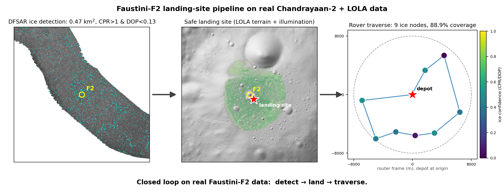
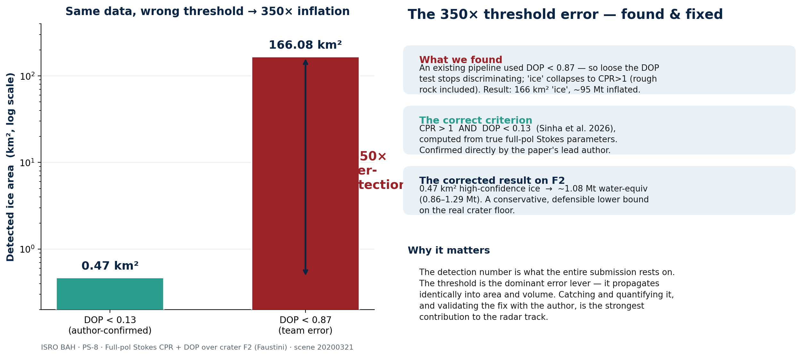
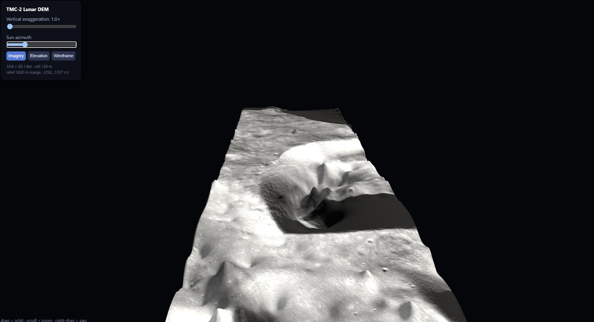
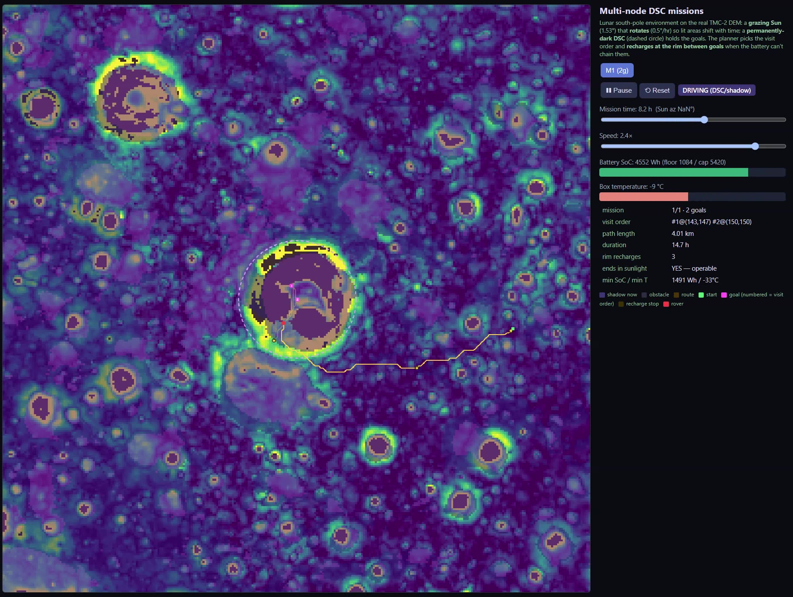
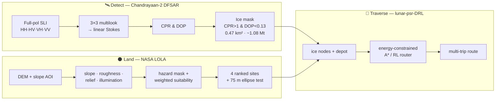
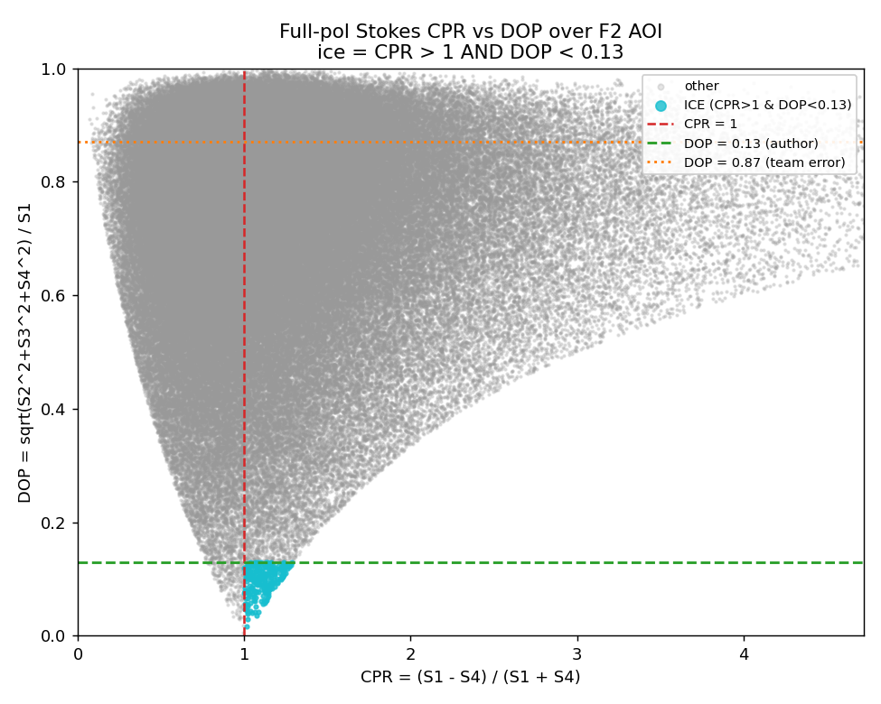

# Lunar Subsurface-Ice Detection & Rover Mission Planning

*Finding water ice at the lunar south pole and planning a safe landing + rover traverse to reach it — from real Chandrayaan-2 radar and NASA LOLA topography.*

[](https://www.python.org/)
[](LICENSE)

> ### 🏆 Top 10 — ISRO Bharatiya Antariksh Hackathon 2026 (Problem Statement 8)

This project takes a doubly-shadowed south-polar crater — **F2 (Faustini), 87.39°S 82.31°E** —
and runs the full mission-planning loop on **real data**: detect subsurface water ice from
Chandrayaan-2 DFSAR polarimetric radar, select a safe landing site from LOLA topography, and
plan an energy-constrained rover traverse to the ice. No synthetic stand-ins, no black boxes —
every number below is reproducible from the code in this repository.



---

## Headline results

| Result | Value |
|--------|-------|
| **High-confidence subsurface ice over F2** | **0.47 km²** (`CPR > 1 AND DOP < 0.13`) |
| **Water-equivalent mass** | **≈ 1.08 Mt** (range **0.86 – 1.29 Mt**, porosity 0.40–0.60) |
| **Inherited-pipeline error found & corrected** | a **~350× over-detection** — an inherited `DOP < 0.87` threshold flagged **166 km²** of surface scatter as ice; the author-confirmed `DOP < 0.13` isolates the real **0.47 km²** |
| **Ranked landing sites** | **4 profiles** — `closest_ice`, `safest`, `balanced`, `best_lit` |
| **Selected landing site** | 83.12°E, 87.36°S — **1.38 km** from F2, mean slope **1.35°**, 67 % go-terrain within 1 km |
| **Rover traverse** | 9 ice nodes, 88.9 % coverage, energy-constrained multi-trip route |

The ~350× correction is the story we're proudest of: the same detection criterion, applied with
the wrong depolarization threshold, over-reports ice by two and a half orders of magnitude.



---

## Demo

### In-house DEM from Chandrayaan-2 TMC-2 stereo



*An in-house digital elevation model built from Chandrayaan-2 **TMC-2 stereo triplets**
(fore / nadir / aft), orthorectified and matched by **dense normalised cross-correlation**.
Coverage **19.4 × 60.1 km** at **120 m** posting, spanning **3630 m** of relief. This DEM
underpins the rover-traverse simulation below.*

### Rover traverse over real F2 terrain

[](assets/rover_traverse_f2.mp4)

*Click the still above to play the simulation → [`assets/rover_traverse_f2.mp4`](assets/rover_traverse_f2.mp4).
The traverse runs over the **actual F2 crater terrain reconstructed from real DEM data — not a
synthetic environment**.*

---

## Method

**Detection (Chandrayaan-2 DFSAR, full-pol scene `20200321t082617351`).**
From the four complex channels (HH, HV, VH, VV) we form the **linear-basis Stokes parameters**
of the backscatter — after a mandatory **3×3 boxcar multilook** of the intensity/covariance
terms:

```
S1 = |HH|² + 2|HV|² + |VV|²     (total power)
S2 = |HH|² − |VV|²
S3 =  2·Re(HH·conj(VV))
S4 = −2·Im(HH·conj(VV))
```

From Stokes we derive two polarimetric descriptors and apply the ice criterion:

- **CPR** (Circular Polarization Ratio) = (S1 − S4) / (S1 + S4) — high CPR indicates
  wavelength-scale roughness / coherent backscatter.
- **DOP** (Degree of Polarization) = √(S2² + S3² + S4²) / S1 — **low** DOP indicates
  volume (multiple) scattering, the signature of buried ice.
- **ICE ⇔ `CPR > 1` AND `DOP < 0.13`** (Sinha et al. 2026, author-confirmed).

The complex scene is geocoded to 25 m south-polar-stereographic via thin-plate-spline GCPs
built from the `g_sli` geometry, cropped to a ±15 km AOI around F2, and masked to in-swath
valid data. Detected pixels are converted to water-equivalent mass with Maxwell-Garnett +
Birchak dielectric mixing over an assumed 5 m sensing depth.

**Landing-site selection (NASA LOLA, Barker et al. 2021).**
Slope, roughness, local relief, curvature and a horizon-based illumination proxy are computed
over the AOI. A **hazard mask** hard-rejects steep/rough/high-relief/crater terrain
(slope > 10°). Surviving terrain is scored by a transparent, physics-based
**weighted multi-criteria suitability** model, evaluated under four weightings. Each candidate
must pass a **75 m landing-ellipse test** — a contiguous safe footprint, not one lucky pixel.

**Traverse (`lunar-psr-DRL` submodule).**
The detected ice pixels are clustered into router nodes; the selected landing site becomes the
depot. Routing is solved two ways for comparison: an **energy/illumination-aware, time-limited
A\*** (plus a Greedy + 2-opt baseline) and a **transformer encoder-decoder reinforcement-learning
router** that produces good energy-constrained multi-trip routes in milliseconds at any size.

---

## Architecture



---

## Repository structure

```
lunar_landing/
├── README.md
├── LICENSE                     MIT
├── requirements.txt            pinned to the tested runtime
├── config/config.yaml          single source of truth for all paths & parameters
├── src/lunar_ice/              the importable package
│   ├── io_utils.py             config, CRS transforms, window-reads, raster I/O
│   ├── terrain.py              slope-derived roughness, local relief, curvature
│   ├── illumination.py         horizon ray-cast illumination proxy + PSR mask
│   ├── suitability.py          normalization, hazard mask, weighted suitability
│   ├── candidates.py           landing-ellipse test + ranked-candidate scoring
│   ├── dfsar.py                DFSAR/full-pol Stokes → CPR/DOP → ice → volume
│   └── viz.py                  hillshade, hero figures, hand-off writer
├── scripts/                    numbered pipeline entry points (00 → 09)
│   ├── 00_prepare.py           locate F2 in the DEM CRS, crop the AOI
│   ├── 01_terrain.py           slope / roughness / relief / curvature
│   ├── 02_illumination.py      horizon illumination index + PSR mask
│   ├── 03_suitability.py       normalize + weight + hazard mask
│   ├── 04_candidates.py        4 profiles → ranked sites + ellipse test
│   ├── 05_figures.py           landing figures + hand-off products
│   ├── 06_dfsar_detect.py      DFSAR L3C derived-mosaic ice detection
│   ├── 07_export_candidates.py cluster ice pixels → router nodes + depot
│   ├── 08_fp_detect.py         full-pol Stokes CPR + DOP ice detection
│   └── 09_pipeline_figure.py   three-panel detect → land → traverse hero
├── docs/                       methodology report, hand-off interface, figure guide
├── assets/                     figures embedded in this README
├── outputs/                    results (rasters git-ignored; geojson/json/csv committed)
├── data/                       git-ignored inputs — see data/README.md to obtain them
└── lunar-psr-DRL/              submodule: RL + A* rover-traverse router
```

---

## Installation

```bash
git clone --recursive https://github.com/PranjalSri108/ISRO_BAH_26_lunar_ice.git
cd ISRO_BAH_26_lunar_ice

# if you already cloned without --recursive:
git submodule update --init --recursive

python3 -m venv .venv && source .venv/bin/activate
pip install -r requirements.txt

# GDAL command-line tools are also required (script 08 uses gdalwarp):
#   e.g.  sudo apt-get install gdal-bin
```

Then follow [`data/README.md`](data/README.md) to download the DFSAR and LOLA inputs
(they are not committed) and place them where `config/config.yaml` expects.

## Quickstart — run the pipeline in order

The package is imported from `src/`, so run scripts with `PYTHONPATH=src`:

```bash
# --- Landing-site selection (LOLA) ---
PYTHONPATH=src python3 scripts/00_prepare.py        # locate F2, crop the AOI
PYTHONPATH=src python3 scripts/01_terrain.py        # slope / roughness / relief / curvature
PYTHONPATH=src python3 scripts/02_illumination.py   # illumination proxy + PSR mask
PYTHONPATH=src python3 scripts/03_suitability.py    # hazard mask + weighted suitability
PYTHONPATH=src python3 scripts/04_candidates.py     # 4 ranked landing sites
PYTHONPATH=src python3 scripts/05_figures.py        # figures + hand-off products

# --- Subsurface-ice detection (DFSAR) ---
PYTHONPATH=src python3 scripts/06_dfsar_detect.py   # L3C derived-mosaic ice
PYTHONPATH=src python3 scripts/08_fp_detect.py      # full-pol CPR + DOP ice (headline)

# --- Hand-off to the router + hero figure ---
PYTHONPATH=src python3 scripts/07_export_candidates.py  # ice nodes + depot for the router
PYTHONPATH=src python3 scripts/09_pipeline_figure.py    # three-panel hero figure
```

Results are written to `outputs/`; the tiny result files (GeoJSON candidates, `manifest.json`,
detection `stats.json`, `volume.csv`) are committed so you can inspect the numbers without
re-running anything.

---

## Selected results

**Ice detection over F2** (full-pol scene, `outputs/fp_f2/stats.json`):



**Ranked landing sites** (`outputs/landing_candidates.geojson`):

| Rank | Profile | Dist. to F2 | Mean slope | Max slope | Go-terrain (1 km) | Score |
|-----:|---------|-----------:|-----------:|----------:|------------------:|------:|
| 1 | `closest_ice` | 1.38 km | 1.35° | 3.64° | 67 % | 0.863 |
| 2 | `safest`      | 1.82 km | 0.96° | 2.77° | 82 % | 0.842 |
| 3 | `balanced`    | 1.41 km | 1.51° | 3.69° | 67 % | 0.793 |
| 4 | `best_lit`    | 5.32 km | 0.98° | 5.38° | 97 % | 0.605 |


---

## Limitations

We report these plainly because a landing decision depends on them:

- **Radar detection is indicative, not conclusive.** CPR + DOP is a strong subsurface-ice
  *signature*, but coherent backscatter has other causes; ground truth would need
  in-situ or additional sensing.
- **No incidence-angle correction.** Backscatter is used as delivered; local incidence is
  not normalized.
- **Multilook only — no dedicated speckle filter.** A 3×3 boxcar multilook is applied; there
  is no Lee/Frost/refined speckle filtering.
- **Illumination is a topographic proxy.** The illumination index is a horizon ray-cast, not
  a Sun-ephemeris + shadow-ray model; treat it as a power/comms proxy.
- **Volume is assumption-dependent.** Water-equivalent mass scales with an assumed **5 m**
  sensing depth and the Maxwell-Garnett / Birchak dielectric-mixing and pore-filling
  assumptions; we report a porosity range (0.40–0.60) rather than a single figure.
- **F2 "interior" is a proxy disk.** No published F2 rim polygon accompanies these data, so
  crater interior is approximated by a radius disk.
- **Catalogue cross-validation is out-of-AOI.** The nearest ICY_CRATERS_SP catalogue ice is
  ~20 km from F2, so overlap-based recovery is not meaningful at F2 itself.

---

## Presentation

The official presentation deck submitted to the ISRO Bharatiya Antariksh Hackathon 2026
(Problem Statement 8) is included here:
**[`docs/ISRO_BAH_2026_Deck.pdf`](docs/ISRO_BAH_2026_Deck.pdf)**.

---

## References

*As cited in this project (verify full bibliographic details against source before formal use):*

- **Sinha, R. K., et al. (2026).** Full-polarimetric CPR + DOP detection of subsurface water
  ice in lunar polar craters. *(Detection criterion `CPR > 1 AND DOP < 0.13` — author-confirmed for this work.)*
- **Putrevu, D., et al. (2021).** Chandrayaan-2 Dual-Frequency Synthetic Aperture Radar
  (DFSAR): instrument description and initial results.
- **Raney, R. K. (2012).** Decomposition of hybrid-polarity radar data (m-χ / CPR) for
  planetary ice discrimination.
- **Barker, M. K., et al. (2021).** Improved LOLA elevation maps for lunar south-pole
  landing sites. *Planetary and Space Science.*
- **Kool, et al. (2018).** Polarimetric radar analysis of lunar polar volatile deposits.

---

## Acknowledgements

- **Dr. Rishitosh K. Sinha** — for confirming the CPR/DOP subsurface-ice detection criterion.
- **ISRO / PRADAN (ISSDC)** — for the Chandrayaan-2 DFSAR data.
- **NASA PGDA** — for the LOLA south-polar topography.

## Team

**Team Cypher** — ISRO Bharatiya Antariksh Hackathon 2026, Problem Statement 8.

<!-- TODO(team): replace the handles below with each member's full name and role. -->

- Detection & landing-site pipeline — [@PranjalSri9108](https://github.com/PranjalSri9108)
- Rover-traverse router (`lunar-psr-DRL`) — [@AravG13](https://github.com/AravG13)

## License

Released under the [MIT License](LICENSE).
